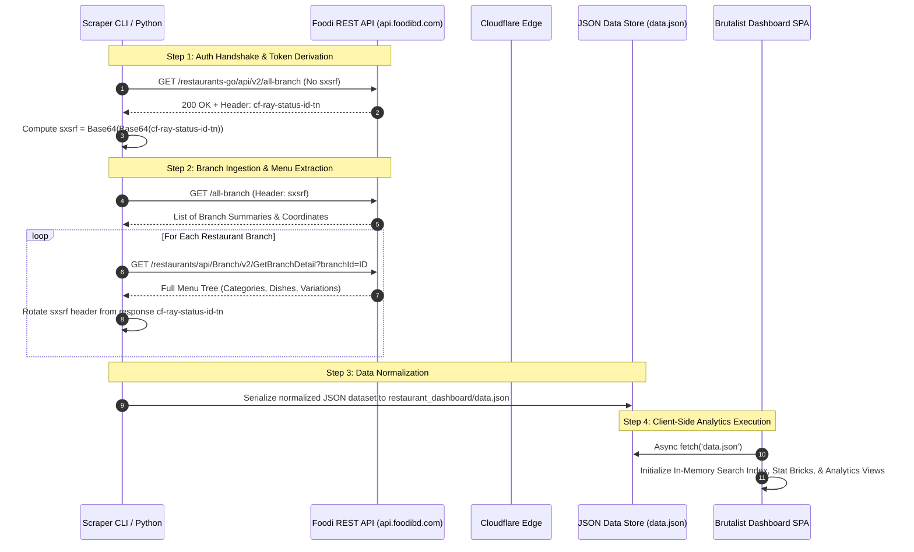

# FOODI//EATS — Brutalist Restaurant Intelligence & Analytics Platform

[](https://ranehal.github.io/FooDIE-RESTaurant-Analytics/)
[](https://www.python.org/)
[](https://developer.mozilla.org/)
[](https://w3.org)
[](LICENSE)

An enterprise-grade, high-performance **Restaurant Intelligence & Menu Analytics Engine**. This system reverse-engineers production food delivery APIs, extracts nested menu hierarchies, performs real-time market forensics, and renders interactive analytics dashboards through a high-contrast Brutalist UI.

---

## 🌟 Live Demo & Preview

Explore the live interactive dashboard directly on GitHub Pages:
👉 **[https://ranehal.github.io/FooDIE-RESTaurant-Analytics/](https://ranehal.github.io/FooDIE-RESTaurant-Analytics/)**

---

## 🚀 Key Features

### 1. ⚡ Live API Scraper Engine (`scrape_menus.py`)
- **Reverse-Engineered Auth Handshake**: Automatically resolves and maintains Foodi's custom security signature (`sxsrf` token derived via double Base64 encoding of Cloudflare `cf-ray-status-id-tn` response headers).
- **Multi-Location Geofencing**: Simultaneously ingests restaurant branch catalogs across distinct coordinates (e.g., Khilgaon, Banasree, Dhanmondi, Gulshan).
- **Deep Menu Extraction**: Recursively extracts branch profiles, categories, item options, variations, add-ons, price markdowns, preparation times, and image URLs.
- **Fault-Tolerant Session Rotation**: Auto-recovers from `401 Unauthorized` states by performing a dynamic auth bootstrap flow every 25 requests or upon consecutive rate limits.

### 2. 🔍 HAR Network Archive Inspector & Extractor (`parse_hars.py`)
- **Offline Dataset Compilation**: Extracts and normalizes network traffic captured from HAR archives (`.har` files) into structured JSON.
- **Image URL Reconstruction**: Normalizes relative CDN paths into fully qualified image assets across high-res cover photos and dish thumbnails.

### 3. 🎨 High-Contrast Brutalist Analytics Dashboard (`/restaurant_dashboard`)
- **Restaurant War Room View**: Grid matrix displaying live operating status (Open/Closed), delivery time benchmarks, ratings, total review counts, and minimum order values.
- **Granular Item Forensics**: Filter items by active markdowns/discounts, cuisine classifications, price ranges, and preparation speed.
- **Intelligence & Market Analytics Tab**: Interactive visualization of cuisine distributions, average pricing tiers, delivery speed breakdowns, and top-rated merchants.
- **Side-by-Side Restaurant Comparator**: Compare multiple restaurants across delivery charges, ratings, dish count, and price indexes in real time.
- **Item Watchlist & Order Builder**: Live shopping cart engine with dynamic item variation total calculation and budget breakdown.
- **High-Res Media Viewer**: Full-screen modal media inspector supporting drag/touch gestures for high-definition branch imagery and food photography.

---

## 🏗️ System Architecture & Data Pipeline

The diagram below illustrates the end-to-end data pipeline from the Foodi REST API to the client-side Brutalist Analytics Dashboard:



---

## 🔑 Reverse-Engineered Security & Auth Protocol

Foodi's backend (`api.foodibd.com`) enforces an undocumented request validation protocol using a custom `sxsrf` HTTP header.

### `sxsrf` Token Derivation Algorithm
1. **Initial Challenge Request**:
   Send an unauthenticated `GET` request to `/restaurants-go/api/v2/all-branch` with standard Android client headers:
   ```http
   accept: application/json
   content-type: application/json
   origin: foodi-prod-android 8.0.3 16 1b5a4567bbcb95d4
   user-agent: ktor-client
   x-requested-with: XMLHttpRequest
   ```

2. **Header Extraction**:
   Inspect response headers for `cf-ray-status-id-tn` (e.g., `8a7f10b2c3d4-DAC`).

3. **Double Base64 Encoding**:
   The token must be base64 encoded twice before being attached as `sxsrf`:
   $$\text{sxsrf} = \text{Base64}\left(\text{Base64}\left(\text{cf-ray-status-id-tn}\right)\right)$$

   *Python implementation snippet (`scrape_menus.py`):*
   ```python
   import base64

   def double_b64(val: str) -> str:
       first_pass = base64.b64encode(val.encode("utf-8")).decode("utf-8")
       return base64.b64encode(first_pass.encode("utf-8")).decode("utf-8")
   ```

4. **Rolling Session Refresh**:
   On every successful HTTP 200 response, extract the new `cf-ray-status-id-tn` header value to generate the `sxsrf` header for the next API request. If an HTTP 401 occurs, trigger the bootstrap handshake.

---

## 📊 Dataset Schema Reference

The output `data.json` contains a structured schema organized by location and branch details:

```json
{
  "scrapedAt": "2026-07-24T18:30:00.000Z",
  "locations": [
    {
      "name": "Khilgaon",
      "lat": 23.7480914,
      "lng": 90.4344348,
      "branches": [
        {
          "id": 4121,
          "name": "Kacchi Bhai - Khilgaon",
          "primaryCuisine": "Biryani, Kacchi",
          "rating": 4.6,
          "ratingCount": 1250,
          "deliveryTime": 35,
          "deliveryCharge": 40.0,
          "minOrderValue": 100.0,
          "location": { "latitude": 23.7481, "longitude": 90.4345 },
          "categories": [
            {
              "id": 101,
              "name": "Main Platters",
              "dishes": [
                {
                  "id": 9012,
                  "name": "Kacchi Biryani (Basmati)",
                  "price": 320.0,
                  "discountPrice": 280.0,
                  "description": "Premium mutton kacchi biryani served with potato and salad.",
                  "imageUrl": "/images/dishes/kacchi.jpg",
                  "variations": [...]
                }
              ]
            }
          ]
        }
      ]
    }
  ]
}
```

---

## 💻 Tech Stack

- **Backend / Scraping**: Python 3.10+, `httpx` (async HTTP client with HTTP/2 support), `json`, `base64`.
- **Frontend Engine**: HTML5, Vanilla CSS3 (Custom Properties, Flexbox & CSS Grid, Glassmorphism, Brutalist Tokens), Vanilla JavaScript (ES6+ Modules, Async/Await, Web Storage API).
- **Iconography & Fonts**: FontAwesome 6.5.2 Pro, Google Fonts (Space Grotesk / JetBrains Mono).
- **Deployment**: GitHub Pages (Automated static hosting via GitHub Actions / main branch root).

---

## 🛠️ Installation & Setup

### Prerequisites
- **Python 3.8+** installed on your system.
- Modern web browser (Chrome, Firefox, Edge, Safari).

### 1. Clone the Repository
```bash
git clone https://github.com/ranehal/FooDIE-RESTaurant-Analytics.git
cd FooDIE-RESTaurant-Analytics
```

### 2. Install Dependencies
```bash
pip install httpx
```

### 3. Run the Scraper (Optional)
To fetch fresh live restaurant and menu data directly from Foodi:
```bash
python scrape_menus.py
```
This updates `restaurant_dashboard/data.json`.

### 4. Launch the Brutalist Dashboard
You can launch the dashboard using Python's built-in HTTP server or the included Windows batch script:

#### Using Windows Batch Script (`run.bat`):
Simply double click `run.bat` or execute in terminal:
```cmd
.\run.bat
```
Select option `[2]` to start the dashboard server, or `[4]` to scrape and automatically open the browser.

#### Using Python Terminal:
```bash
cd restaurant_dashboard
python -m http.server 8080
```
Open your browser and navigate to: **`http://localhost:8080`**

---

## 🌐 Hosting on GitHub Pages

This project is configured to run out-of-the-box on GitHub Pages.

1. **Repository Settings**:
   - Go to your GitHub repository: `https://github.com/ranehal/FooDIE-RESTaurant-Analytics`
   - Click on **Settings** -> **Pages** (under Code and automation).
   - Under **Build and deployment**:
     - **Source**: Select `Deploy from a branch`.
     - **Branch**: Select `main` / `/(root)` and click **Save**.

2. **Access Live URL**:
   Your site will be live at `https://ranehal.github.io/FooDIE-RESTaurant-Analytics/` within 1–2 minutes!

---

## 📁 Repository Structure

```
FooDIE-RESTaurant-Analytics/
├── .gitignore                      # Git exclusion rules
├── .nojekyll                       # Bypass Jekyll processing on GitHub Pages
├── index.html                      # Root landing page redirect for GitHub Pages
├── README.md                       # Enterprise technical documentation
├── run.bat                         # Windows batch launcher (Scraper + Dashboard)
├── check_api.py                    # HAR request inspector & header analysis utility
├── debug_api.py                    # API auth handshake test harness
├── parse_hars.py                   # HAR network dump parser & extractor
├── scrape_menus.py                 # Production live multi-location menu scraper
└── restaurant_dashboard/           # High-Performance Brutalist Analytics UI
    ├── data.json                   # Aggregated restaurant & menu dataset (~13.8 MB)
    ├── index.html                  # Main Web Application Shell & HTML structure
    ├── script.js                   # Client-side state manager, search engine & renderer
    └── style.css                   # Brutalist CSS design system & responsive styling
```

---

## 📄 License

Distributed under the **MIT License**. See `LICENSE` for more information.

---

<p align="center">
  <b>FOODI//EATS RESTAURANT INTELLIGENCE</b> • Built with 💛 for Restaurant Forensics & Data Analytics.
</p>
