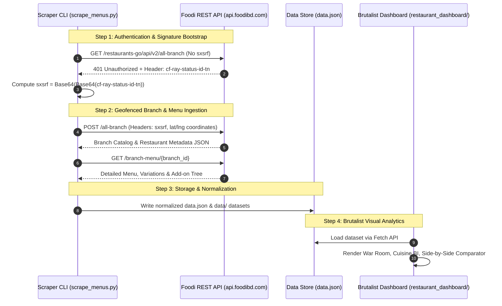

# 🍜 FOODI//EATS — Brutalist Restaurant Intelligence Engine

> **Enterprise-Grade Food Delivery Telemetry, Multi-Location Geofencing & Brutalist Analytics Dashboard for Foodi Bangladesh.**

[](https://ranehal.github.io/FooDIE-RESTaurant-Analytics/)
[](https://www.python.org/)
[](https://developer.mozilla.org/)
[](https://w3.org)
[](LICENSE)

---

## 📌 Executive Summary

**FOODI//EATS** is an enterprise-grade restaurant intelligence and menu analytics platform built for [Foodi](https://foodibd.com) (`api.foodibd.com`), US-Bangla Group's food delivery service in Bangladesh.

The platform reverse-engineers Foodi's custom cryptographic authentication signatures (`sxsrf`), performs multi-location geofenced restaurant harvesting across major commercial hubs (Gulshan, Banasree, Dhanmondi, Khilgaon), extracts nested menu hierarchies (variations, add-ons, price markdowns), and presents market forensics through a high-contrast **Brutalist UI** dashboard.

---

## 🚀 Key Features

- **🔐 Reverse-Engineered Cryptographic Signature (`sxsrf`)**: Bypasses Cloudflare edge protection by computing double-Base64 transformations (`Base64(Base64(header_value))`) of Cloudflare `cf-ray-status-id-tn` response headers.
- **📍 Multi-Location Geofencing**: Simultaneously ingests branch catalogs across distinct coordinate zones in Metro Dhaka.
- **🍽️ Deep Menu Forensics**: Recursively extracts branch profiles, categories, item variations, add-on groups, price markdowns, preparation times, and high-res media.
- **🎨 High-Contrast Brutalist Analytics Dashboard**: High-density grid matrix featuring restaurant operating status, delivery time benchmarks, cuisine distribution charts, side-by-side restaurant comparators, and dynamic watchlist order builders.
- **🔍 HAR Network Archive Inspector (`parse_hars.py`)**: Offline dataset extractor capable of compiling raw `.har` network archives into structured JSON datasets.

---

## 🏗️ System Architecture



---

## 🔑 Authentication Specification

The Foodi API at `api.foodibd.com` implements custom request validation:

1. **Header Extraction**: Inspect `cf-ray-status-id-tn` header returned on `401 Unauthorized` responses.
2. **Signature Derivation**:
   $$\text{sxsrf} = \text{Base64}\left(\text{Base64}\left(\text{cf-ray-status-id-tn}\right)\right)$$
3. **Session Rotation**: Ingestion auto-refreshes auth signatures every 25 requests or upon consecutive rate-limit responses.

---

## 📁 Repository Structure

```
FooDIE_restaurants/
├── scrape_menus.py       # Production multi-location API scraper & menu extractor
├── parse_hars.py         # HAR archive network inspector and dataset builder
├── debug_api.py          # API endpoint diagnostic tool
├── check_api.py          # Signature validation check utility
├── run.bat               # Windows launcher script
├── data.json             # Compiled restaurant catalog & menu dataset
├── data/                 # Raw branch profile JSON dumps
└── restaurant_dashboard/ # High-Contrast Brutalist UI Dashboard
    ├── index.html        # Main dashboard interface
    ├── app.js            # Dashboard logic, market BI, comparator & watchlist
    └── styles.css        # Brutalist CSS layout styling
```

---

## 🛠️ Usage & Quick Start

### 1. Execute Live Scraper CLI
```bash
# Run multi-location restaurant and menu scraper
python scrape_menus.py
```

### 2. Parse HAR Archives (Offline Extraction)
```bash
# Parse raw .har network dumps into structured JSON datasets
python parse_hars.py
```

### 3. Launch Brutalist Dashboard
```bash
# Serve local web server
python -m http.server 8000
```
Open `http://localhost:8000/restaurant_dashboard` in your browser.

---

## 📜 License

Distributed under the MIT License. Trademarks and data belong to FoodiBD / US-Bangla Group. Built for educational and analytics research.
